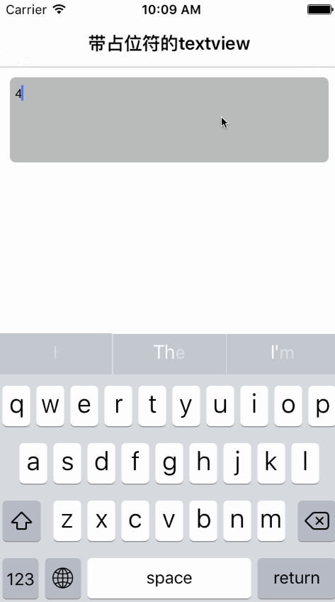

# SYPlaceHolderTextView
继承自UITextView，且带有占位符和block回调的自定义textview

~~~ javascript

#import "SYPlaceHolderTextView.h"

// 实例化
SYPlaceHolderTextView *textview = [[SYPlaceHolderTextView alloc] initWithFrame:CGRectMake(10.0, 10.0, (self.view.frame.size.width - 10.0 * 2), 80.0) view:self.view];

// 属性设置
textview.backgroundColor = [UIColor colorWithWhite:0.0 alpha:0.3];
textview.layer.cornerRadius = 5.0;
textview.layer.masksToBounds = YES;

// 占位符设置
textview.placeHolderText = @"请输入你想要输入的任何信息。注意字数限制！";
textview.placeHolderFont = [UIFont systemFontOfSize:12.0];
textview.placeHolderColor = [UIColor redColor];

// 限制字符长度
textview.limitNumber = 20;

// 回车结束编辑
textview.isEndReturn = YES;

// block回调
[textview textViewStart:^(UITextView *textview) {
    NSLog(@"start text %@", textview.text);
} changeTextInRange:^(UITextView *textview, NSRange range, NSString *text) {
    NSLog(@"change text %@", textview.text);
} changeNotification:^(UITextView *textview) {
    NSLog(@"change text %@", textview.text);
} end:^(UITextView *textview) {
    NSLog(@"end text %@", textview.text);
}];
    
~~~

# 效果图

